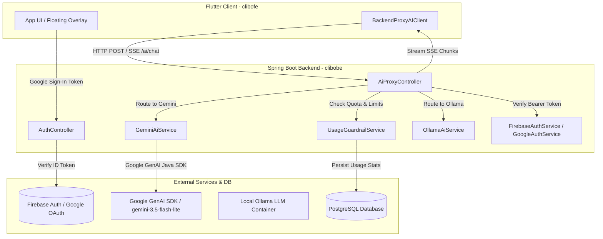
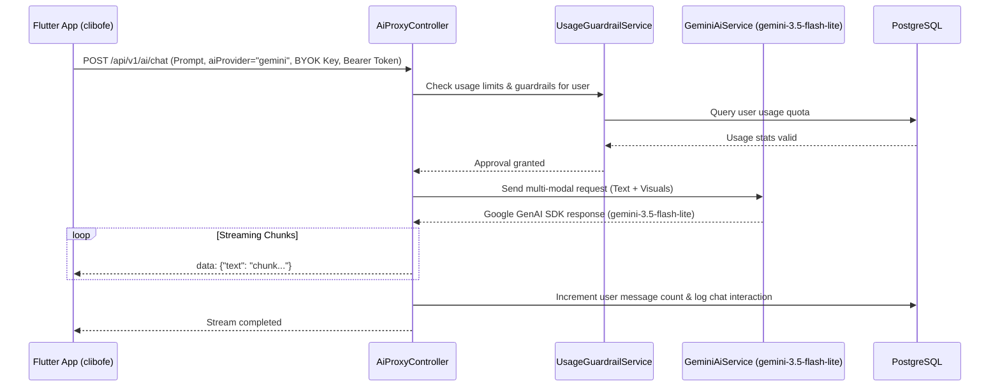

# Clibo Backend Architecture (`clibobe`)

## 1. Overview & Purpose

The **Clibo Backend (`clibobe`)** is a robust enterprise-grade service built with **Spring Boot 4.1.1** and **Java 21**. It serves as the secure orchestration gateway between the Clibo Flutter frontend and AI providers (Google Gemini, local Ollama, OpenAI, Claude), managing user authentication, quota enforcement, chat session history, usage guardrails, and legal consent logging.

---

## 2. System Architecture (Mermaid Diagram)



---

## 3. Core Request Flow & Sequence



---

## 4. Package Structure & Components (`src/main/java/com/claybytes/clibobe/`)

```
clibobe/src/main/java/com/claybytes/clibobe/
├── ClibobeApplication.java
├── config/
│   ├── GeminiConfig.java         # Google GenAI configuration
│   └── GoogleAuthConfig.java     # Google Auth configuration
├── controller/
│   ├── AiProxyController.java    # Multi-modal AI proxy & SSE streaming endpoint
│   ├── AuthController.java       # User authentication & token exchange
│   ├── ConsentController.java    # Legal Terms & Privacy consent audit logging
│   └── UserController.java       # User profile and settings management
├── dto/
│   ├── AiPromptRequest.java      # Incoming request DTO (prompt, aiProvider, BYOK key, base64 media)
│   ├── GeminiRequest.java
│   └── Part.java                 # Multi-modal content parts
├── entity/
│   ├── ChatMessage.java          # Individual chat messages in session
│   ├── ChatSession.java          # Grouped conversation threads
│   ├── ModalityType.java         # Enum for text, image, audio modalities
│   ├── User.java                 # User account entity
│   ├── UserConsent.java          # Legal ToS / Privacy acceptance record
│   └── UserUsage.java            # Usage tracking and guardrail quotas
├── repository/
│   ├── UserRepository.java
│   ├── UserConsentRepository.java
│   └── UserUsageRepository.java
├── service/
│   ├── FirebaseAuthService.java  # Firebase Admin token verification
│   ├── UsageGuardrailService.java# Quota checking & rate limiting logic
│   ├── UserService.java          # Database user creation & login processing
│   └── ai/
│       ├── AiProviderService.java# Strategy interface
│       ├── GeminiAiService.java  # Google GenAI SDK (gemini-3.5-flash-lite)
│       ├── OllamaAiService.java  # Local Ollama endpoint integration
│       ├── OpenAiCompatibleAiService.java # OpenAI / Claude gateway
│       └── CustomAiService.java  # Custom LLM endpoints
└── utilityService/
    └── GoogleAuthService.java
```

---

## 5. Key Services & Security

- **Authentication**: Stateless token validation using `GoogleAuthService` verifying incoming Google OAuth ID tokens and automatically persisting user accounts in PostgreSQL (`users` table).
- **AI Proxying**: `AiProxyController` delegates requests dynamically based on `aiProvider` to `GeminiAiService` (calling `gemini-3.5-flash-lite`, `gemini-3.8-flash`), `OllamaAiService`, or `OpenAiCompatibleAiService`.
- **Guardrails & Auditing**: `UsageGuardrailService` tracks daily request volume, token counts, and feature limits per user, while `ConsentController` logs legal policy agreement (`user_consents`).
- **Database Persistence**: Spring Data JPA with PostgreSQL for relational storage of users, chat history, and usage metrics.
