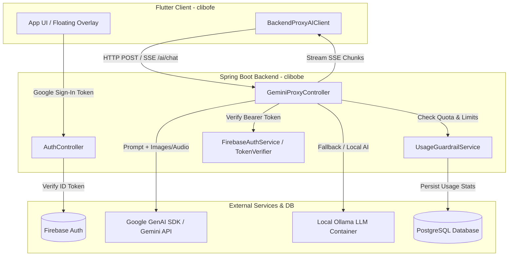
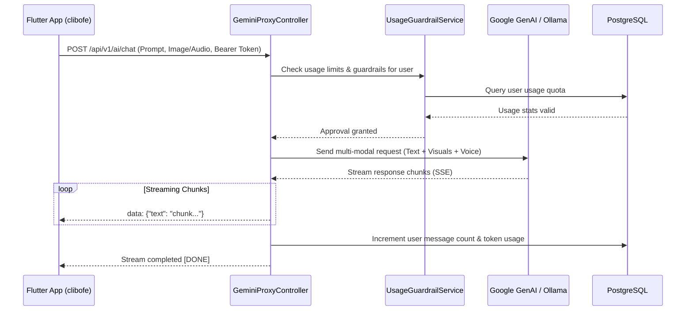

# Clibo Backend Architecture (`clibobe`)

## 1. Overview & Purpose

The **Clibo Backend (`clibobe`)** is a robust enterprise-grade service built with **Spring Boot 4.1.1** and **Java 21**. It serves as the secure orchestration gateway between the Clibo Flutter frontend and AI providers (Google Gemini, local Ollama), managing user authentication, quota enforcement, chat session history, and usage guardrails.

---

## 2. System Architecture (Mermaid Diagram)



---

## 3. Core Request Flow & Sequence



---

## 4. Package Structure & Components (`src/main/java/com/claybytes/clibobe/`)

```
clibobe/src/main/java/com/claybytes/clibobe/
├── ClibobeApplication.java
├── config/
│   ├── GeminiConfig.java         # Google GenAI configuration
│   └── GoogleAuthConfig.java     # Google Auth configuration
├── controller/
│   ├── AuthController.java       # User authentication & token exchange
│   ├── GeminiProxyController.java # Multi-modal AI proxy & SSE streaming endpoint
│   └── UserController.java       # User profile and settings management
├── dto/
│   ├── AiPromptRequest.java      # Incoming request DTO (prompt, base64 media)
│   ├── GeminiRequest.java
│   └── Part.java                 # Multi-modal content parts
├── entity/
│   ├── ChatMessage.java          # Individual chat messages in session
│   ├── ChatSession.java          # Grouped conversation threads
│   ├── ModalityType.java         # Enum for text, image, audio modalities
│   ├── Organization.java         # Multi-tenant organization grouping
│   ├── User.java                 # User account entity
│   └── UserUsage.java            # Usage tracking and guardrail quotas
├── repository/
│   ├── OrganizationRepository.java
│   ├── UserRepository.java
│   └── UserUsageRepository.java
├── service/
│   ├── FirebaseAuthService.java  # Firebase Admin token verification
│   ├── TokenVerifier.java
│   ├── UsageGuardrailService.java# Quota checking & rate limiting logic
│   └── UserService.java
└── utilityService/
    └── GoogleAuthService.java
```

---

## 5. Key Services & Security

- **Authentication**: Stateless token validation using `FirebaseAuthService` verifying incoming Firebase JWTs against Firebase Admin SDK.
- **AI Proxying**: `GeminiProxyController` handles multipart multimodal payloads (text prompts, Base64 screen capture images, and audio notes) and streams responses back to clients via Server-Sent Events (SSE).
- **Guardrails**: `UsageGuardrailService` tracks request volume, token counts, and feature limits per user to prevent abuse and manage API costs.
- **Database Persistence**: Spring Data JPA with PostgreSQL for relational storage of users, organizations, chat history, and usage metrics.
